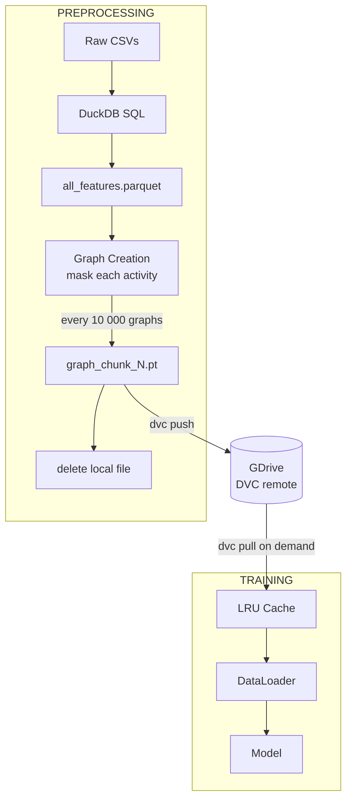
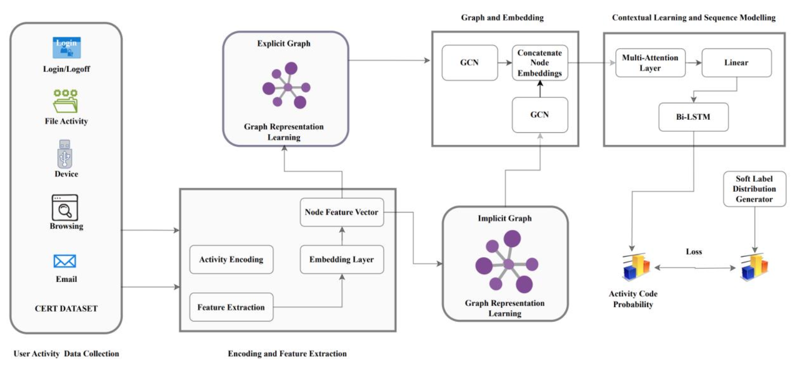
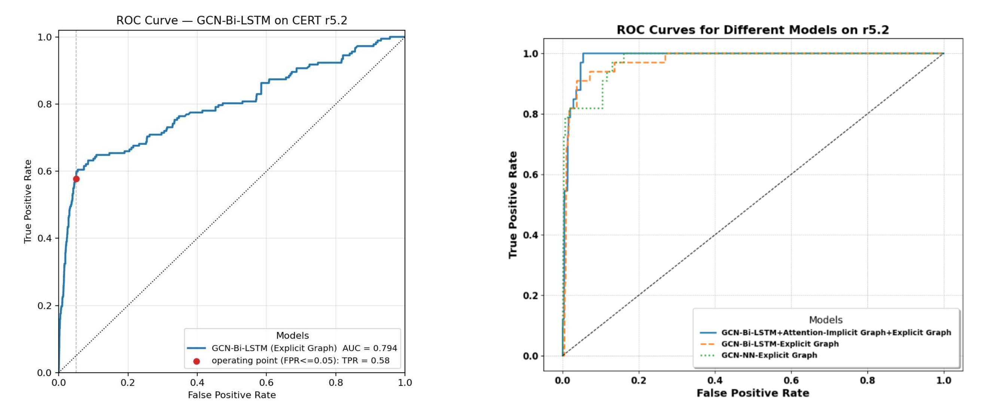
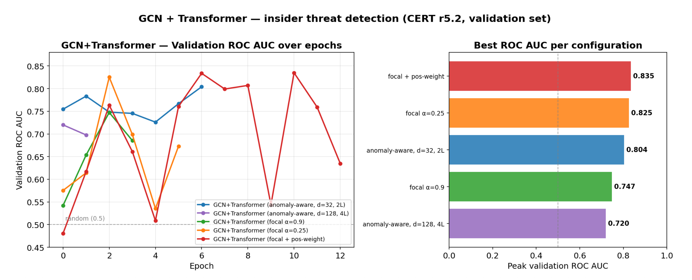

# Insider Threat Detection with GNN and Bi-LSTM

Self-supervised graph neural network approach to insider threat detection on the CMU CERT r5.2 dataset.
The model learns normal user behaviour through masked activity prediction and flags activities with
anomalously low predicted probability — without ever seeing explicit malicious labels during training.

## Problem & Motivation

**Insider threat** refers to malicious activities carried out by trusted individuals with legitimate
access to sensitive systems. Detection is hard precisely because the behaviour looks authorised.

Recent industry data underscores the scale:

- **CrowdStrike 2024/2025 Global Threat Report**: 79 % of attacks are now malware-free, making
  User and Entity Behaviour Analytics (UEBA) the primary detection surface — and the only technique
  that can catch zero-day attacks where signature-based methods fail.
- **2024 Insider Threat Report (Cybersecurity Insiders / IBM)**: 83 % of organisations experienced
  at least one insider attack in the past year.

## Dataset

**CMU CERT Insider Threat Dataset r5.2** (synthetic, 10.37 GB)

Available log types: Logon/Logoff events, HTTP browsing history, Email traffic, File operations,
USB device usage.

Key characteristic: **extreme class imbalance** — threat scenarios represent a microscopic fraction
of all daily activities (< 0.15 % of sessions in our splits).

```bash
uv run download-data
cd data/raw/cmu_cert_r5.2
tar -xjf r5.2.tar.bz2
tar -xjf answers.tar.bz2
```

## Method

### Pipeline overview

1. Log encoding & feature extraction (DuckDB SQL → Parquet)
2. Graph construction (sessions → sub-sessions → PyG `Data` objects)
3. Node embedding generation (GCN)
4. Attention over node embeddings
5. Bi-LSTM over masked sub-session graphs
6. Anomaly scoring via prediction probability threshold

### Preprocessing & Graph Construction

**Feature extraction** — each log entry is encoded into a feature vector of size *d = 18*.
Features include:

- Supervisor / assigned PC access (binary)
- Elapsed time outside normal working hours (09:00–17:00)
- Weekend access (binary)
- Additional features for File, Email, HTTP events

**Graph construction** — user activity is divided into *sessions* (logon → logoff), then into
*sub-sessions* of 5–50 activities. For each sub-session a graph is built where:

- **Nodes** correspond to individual activities
- **Sequential edges** connect each activity to the one immediately following it
- **Type-based edges** connect activities of the same/similar type (e.g. email↔email,
  logon↔logoff, file-write↔file-open)

### Chunking & DVC Storage

Graphs are streamed to disk in chunks of 10 000, pushed to a GDrive DVC remote, and pulled
on-demand into an LRU cache during training — keeping RAM usage bounded regardless of dataset size.



### Model Architecture

The default model (`gcn_lstm`) combines a GCN, graph attention, and a Bi-LSTM:

| Component | Details |
|-----------|---------|
| GCN | 2 layers, hidden dim 16, ReLU + dropout 0.5 |
| Graph Attention | query–key similarity over node embeddings; highlights informative activity relations |
| Bi-LSTM | 2 layers, hidden dim 32 (→ 64 bidirectional), mean pooling over time |
| Output | FC → 192 activity classes |

For each activity *aᵢ* in a sub-session, a masked variant is created:

```
SS  = [A, B, C, D]
SS' = [<MASK>, B, C, D]   →  predict A
      [A, <MASK>, C, D]   →  predict B
      ...
```

The context-aware graph embeddings from the masked sub-session are passed through the Bi-LSTM to
predict the masked activity.



A lightweight baseline (`graph_pool_mlp`) is also available: node encoder → global mean/max
pooling → MLP classifier, used for binary (normal vs. anomalous) classification.

### Anomaly Detection

With *M = 192* activity codes the model outputs a probability distribution over all codes given
the masked sub-session *S'*:

```
y = P(<MASK> = aᵢ | S')
```

An activity is flagged as anomalous when its predicted probability falls below a predefined
threshold. Crucially, **the model never sees explicit malicious labels** — it learns the
distribution of normal behaviour and scores deviations from it. This avoids the data leakage
present in the original paper's implementation.

## Results





## Engineering Notes

**MPS memory leak (macOS)** — training slowed 5–8× after epoch 1 and halted around epoch 5,
with process footprint reaching 62 GB on a 16 GB machine. Root cause: macOS `malloc` never
returns freed pages to the OS. Workaround: kill DataLoader worker subprocesses after every
train/val/test phase. This is a macOS-only allocator issue; it does not occur on Linux/CUDA.

**NFS I/O bottleneck (CUDA cluster)** — migrating to institute machines introduced a new
bottleneck from NFS storage. Resolved by: increasing `num_workers` for parallel prefetch,
tuning batch size, keeping *K* chunks in RAM with random sampling across them (increases batch
diversity), and switching from fp32 to bf16.

## Setup

```bash
uv sync --extra dev
```

## Layout

```
src/certgnn/
├── preprocessing/         # DuckDB feature pipeline + two variants
│   ├── paper_faithful.py     #  fractional users, single chunk stream
│   └── user_level_split.py   #  fixed-count + scenario-stratified split
├── data/                  # chunk store, datasets, sampler, DataModule
├── models/                # gcn_lstm.py + graph_pool_mlp.py + registry
├── losses.py              # anomaly_aware + focal + standard CE
├── lightning/             # BaseLightningModule + two task subclasses
├── callbacks/             # GPUMetricsCallback + build_callbacks fabric
├── train.py               # config-driven entry point
└── ...
```

## Run

```bash
uv run preprocess              # variant picked from config.yaml
uv run train                   # task + model picked from config.yaml
uv run pytest                  # 31 tests
uv run ruff check .
```

CLI overrides for the most common knobs:

```bash
uv run train --task binary --model graph_pool_mlp --max-epochs 5 --fast-dev-run
uv run preprocess-paper-faithful --stream    # bypass dispatcher, pin variant
uv run preprocess-user-split --stream
```

## Config knobs

`configs/config.yaml`:

* `preprocessing.variant` — `paper_faithful` | `user_level_split`
* `training.task` — `anomaly_aware` (192-class) | `binary` (2-class)
* `training.model` — `gcn_lstm` | `graph_pool_mlp`
* `training.{model_args, loss_args, optimizer, scheduler, data, trainer, wandb}`

Adding a new architecture: drop `src/certgnn/models/<name>.py`, register
in `MODEL_REGISTRY`, set `training.model: <name>` in config.yaml.

Adding a new task: drop a subclass of `BaseLightningModule` overriding
`compute_loss`, `collect_eval`, `epoch_metrics`; register in
`LIGHTNING_REGISTRY`.
